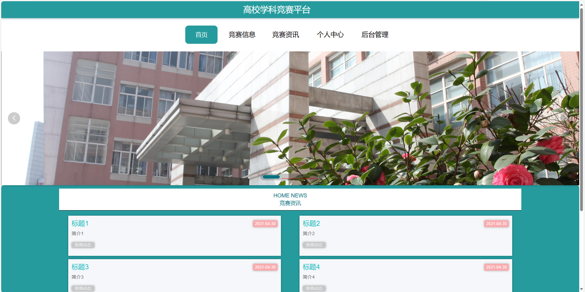
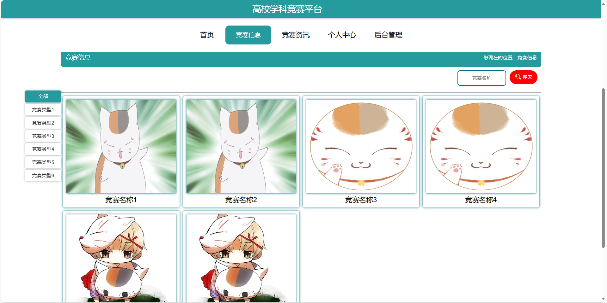
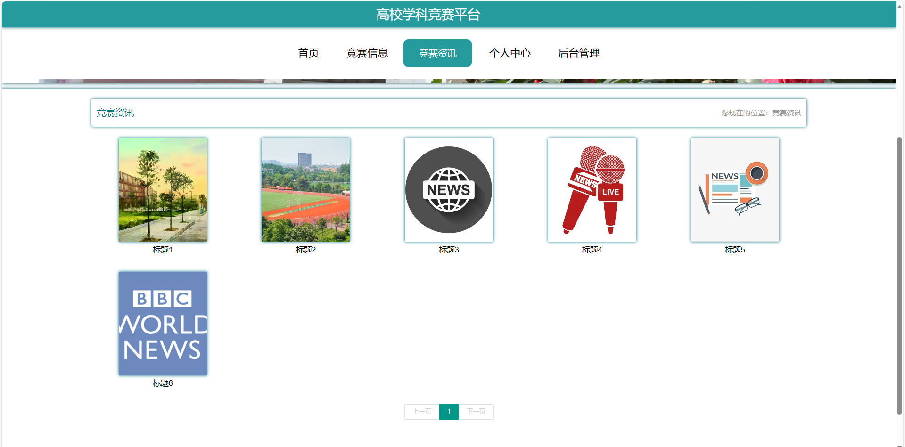
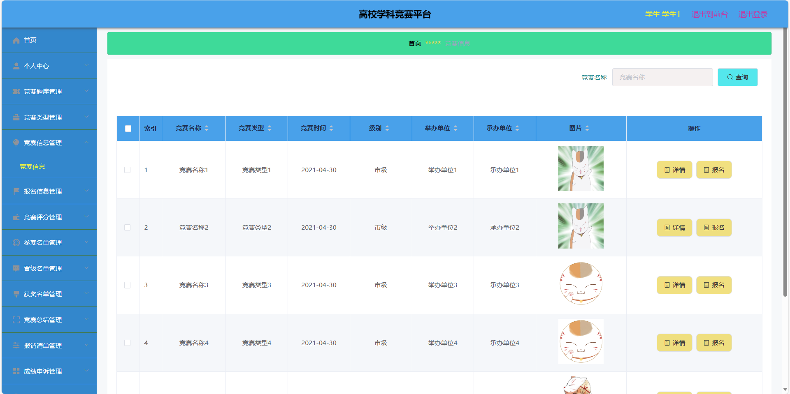
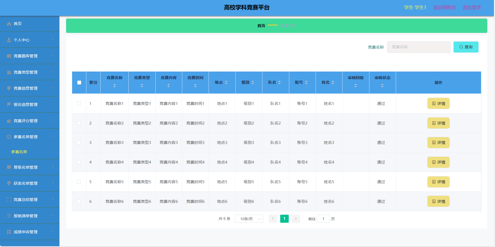
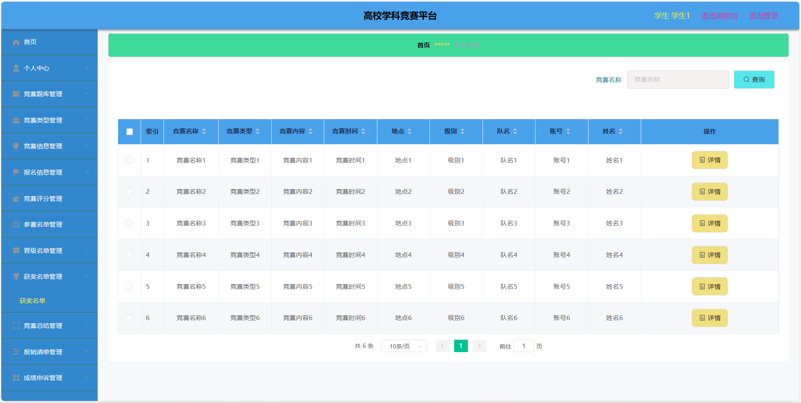
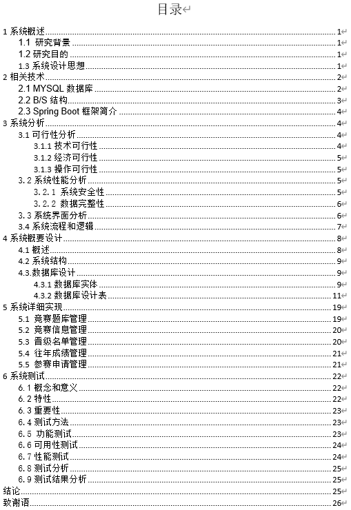
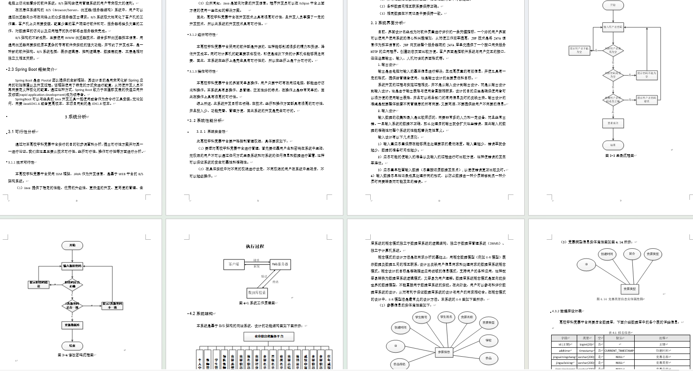

# 基于springboot的学校竞赛管理系统

### 完整项目获取

通过网盘分享的文件：学校竞赛管理系统

链接: https://pan.baidu.com/s/19UEM3JaBiTflswGdx0SF9g?pwd=sjun 提取码: sjun --来自百度网盘超级会员v3的分享

### 项目合集(项目不断更新中，包含java、vue、python、Android、微信小程序等项目)

链接: https://pan.baidu.com/s/1nY-zhvAK0CXYcn3g7LzQnQ?pwd=id3c 提取码: id3c
--来自百度网盘超级会员v3的分享

### 工具包

链接: https://pan.baidu.com/s/1YmdoJvkjoUjA75wvHLDZ6A?pwd=xm96 提取码: xm96
--来自百度网盘超级会员v3的分享

需要远程项目部署或项目修改和毕业设计也可联系（添加申请时请备注好来意）

### 远程调试部署联系方式

链接: https://pan.baidu.com/s/1W0dDcoZmayG0c7USJDYBYg?pwd=nqd7 提取码: nqd7
--来自百度网盘超级会员v3的分享

#### 这些项目一起发你了 可以分享给你需要的同学 调试可找我 也接二次修改和项目定制、毕业设计等

## 接毕业设计和论文

微信联系方式：xzxj0206  QQ：3808981644   (支持修改、 部署调试、 支持代做毕设)

接网站建设、小程序、H5、APP、各种系统等，单片机、嵌入式也可以做

选题+开题报告+任务书+程序定制+安装调试+论文+答辩ppt  都可以做

## 一、介绍

运行环境:idea或eclipse 数据库:mysql

开发语言：java

技术栈：springboot、mybatisplus、vue、html

主要功能：

角色分为学生，教师，领队教师，超级管理员

1、管理员：教师管理、学生管理、领队教师管理、竞赛类型管理、竞赛信息管理、学院管理、专业管理、获奖情况管理、系统管理

2、教师：个人中心、题目类型管理、竞赛题库管理、竞赛类型管理、竟赛信息管理、参赛申请管理、竞赛评分管理、参赛名单管理、晋级名单管理、获奖名单管理、竞赛总结管理、报销清单管理、成绩申诉管理、参赛信息管理

3、领队教师：个人中心、题目类型管理、竟赛题库管理、竞赛类型管理、竟赛信息管理、参赛申请管理、报名信息管理、竞赛评分管理、参名单管理、晋级名单管理、获奖名单管理、竞赛总结管理、报销清单管理、成绩申诉管理、参赛信息管理、往年成绩管理、获奖情况管理

4、学生：首页、竞赛信息、竞赛资讯、个人中心、竟赛题库管理、竞赛类型管理、竟赛信息管理、报名信息管理、竞赛评分管理、参名单管理、晋级名单管理、获奖名单管理、竞赛总结管理、报销清单管理、成绩申诉管理、参赛信息管理、往年成绩管理、获奖情况管理

## 二、部分页面截图展示

## 三、10000字论文参考

